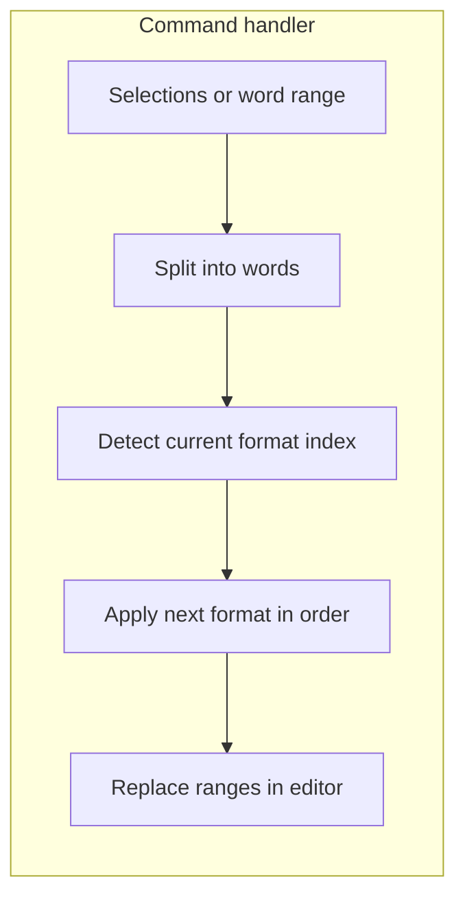

# VS Code / Cursor CamelCase cycling extension

## Reference behavior

The [JetBrains Camel Case Plugin](https://github.com/netnexus/camelcaseplugin) cycles the current identifier through multiple representations (kebab-case, `SNAKE_CASE`, `PascalCase`, `camelCase`, `snake_case`, space case) via **Edit** menu and **Shift+Alt+U** (Windows/Linux) / **⇧⌥U** (macOS), with IDE preferences to **disable** some variants or **reorder** the cycle.

Cursor is VS Code–compatible: a normal VS Code extension runs in Cursor the same way.

## Architecture

- **Activation**: lightweight—register one command (e.g. `camelcase.cycle`) in [`package.json`](package.json) `activationEvents: onCommand:camelcase.cycle` (or `onStartupFinished` if you add status bar later; onCommand keeps startup cost zero).
- **Core logic** (pure functions in a dedicated module, e.g. [`src/caseCycle.ts`](src/caseCycle.ts)):
  - **Tokenize** the selected string into words using the same heuristics as typical case tools: explicit separators (`_`, `-`, spaces), then camel/Pascal boundaries (e.g. `URLParser` → `URL`, `Parser` when splitting for output; start conservative to avoid surprising splits on short acronyms—document behavior and add unit tests).
  - **Enumerate formats** for a fixed word list: `kebab`, `pascal`, `camel`, `snake`, `screaming`, `space` (names aligned with the JetBrains plugin’s set).
  - **Pick “current” index**: compare the trimmed selection (optionally case-normalized where appropriate) against each formatted string for the same word list; if no match, treat as index `-1` and apply the **first** enabled format (predictable first press).
- **Editor integration** ([`src/extension.ts`](src/extension.ts)): for each `TextEditor.selection`, if empty use `document.getWordRangeAtPosition` (language word pattern is usually fine for `foo_bar` in code); if still no range, no-op with an optional `window.showInformationMessage`. Apply edits with a single `WorkspaceEdit` (or `editor.edit`) so **multiple cursors** stay in sync.
- **Settings** in `package.json` `contributes.configuration` (parity with JetBrains “disable / reorder”):
  - e.g. `camelcase.order`: ordered array of format ids (default order matching the plugin’s typical cycle).
  - e.g. `camelcase.formats`: map or list to enable/disable specific ids (or derive enabled set from `order` only—simplest is: **order defines cycle**; omitting an id from order disables it).
- **Keybinding**: `contributes.keybindings` with `shift+alt+u` on Windows/Linux and `shift+alt+u` on macOS (`key` differs per OS in VS Code—use platform-specific entries). Note in README that users may need to resolve conflicts with other extensions.

## Project scaffold (this repo is empty today)

Add a standard minimal layout:

| Artifact | Role |
|----------|------|
| [`package.json`](package.json) | `publisher`, `name`, `engines.vscode`, `main`, `contributes`, scripts |
| [`tsconfig.json`](tsconfig.json) | strict TS, `outDir` |
| [`src/extension.ts`](src/extension.ts) | `activate` / `deactivate`, command registration |
| [`src/caseCycle.ts`](src/caseCycle.ts) | tokenize + format + next-index logic |
| [`.vscodeignore`](.vscodeignore) | exclude `src`, `tsconfig`, tests from `.vsix` |
| [`.vscode/launch.json`](.vscode/launch.json) | F5 “Run Extension” |
| [`README.md`](README.md) | usage, keybinding, settings table, link to original plugin |

**Build**: use **`tsc`** (simplest) or **esbuild** to emit to `out/`; point `package.json` `"main"` at `out/extension.js`. Add `vscode:prepublish` script for packaging.

**Dependencies**: `devDependencies` only—`@types/vscode`, `typescript`, `vscode` (engine), and optionally `@vscode/vsce` for packaging. No runtime npm deps required for core behavior.

**Tests** (recommended): **`vitest`** or **`node:test`** + plain TS imports against `caseCycle.ts` for tokenize/next-format cases (snake, kebab, acronym-heavy identifiers, single word, already-spaced phrase). Keeps regressions out of the tricky boundary logic.

## Deliverable checklist

1. Implement case cycle logic with configurable order (settings).
2. Wire command + default keybinding + `editorTextFocus` `when` clause (and `!editorReadonly` if you want).
3. Support multiple selections and empty selection → word at cursor.
4. Document behavior and settings in README; mention Cursor compatibility.
5. Verify with **Extension Development Host** (F5) and `vsce package` once.

## Non-goals (unless you want them later)

- Localizing UI strings beyond English.
- Web-only VS Code (Cursor is desktop; if you need web, avoid Node-only APIs—current design stays compatible).
- Parsing whole lines or AST-aware renames (stays text-transform like the JetBrains plugin).
